# PES-VCS Lab Submission
## PES2UG24AM134 — Rishaan

---

## Phase 1: Object Storage

### Screenshot 1A — test_objects passing
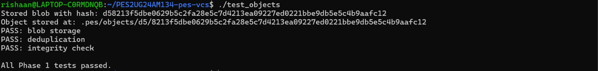

### Screenshot 1B — find .pes/objects -type f
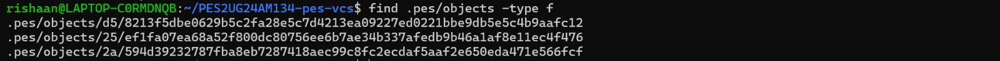

---

## Phase 2: Tree Objects

### Screenshot 2A — test_tree passing
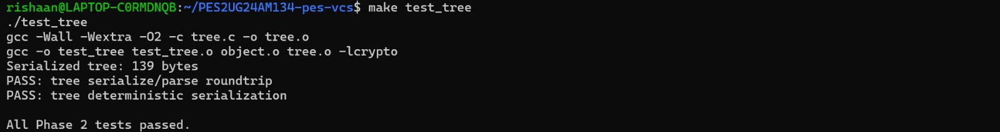

### Screenshot 2B — xxd of raw tree object
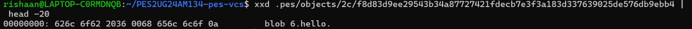

---

## Phase 3: Index (Staging Area)

### Screenshot 3A — pes init, pes add, pes status
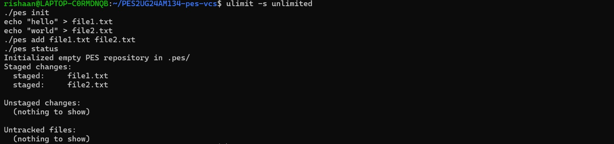

### Screenshot 3B — cat .pes/index
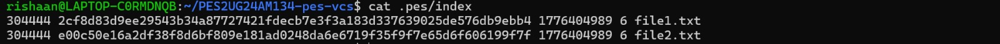

---

## Phase 4: Commits and History

### Screenshot 4A — pes log with three commits
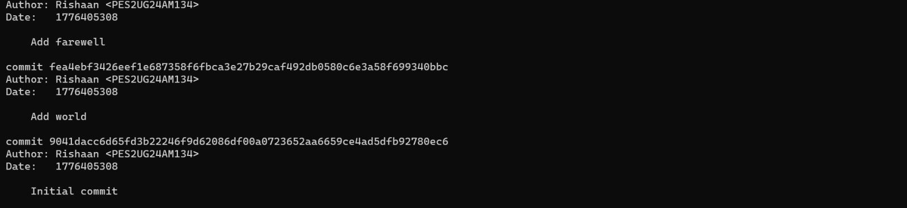

### Screenshot 4B — find .pes -type f | sort
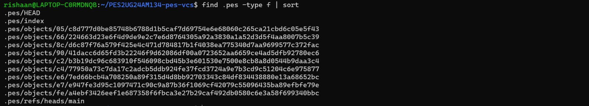

### Screenshot 4C — cat .pes/refs/heads/main and cat .pes/HEAD
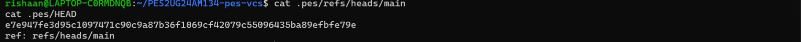

### Final — make test-integration
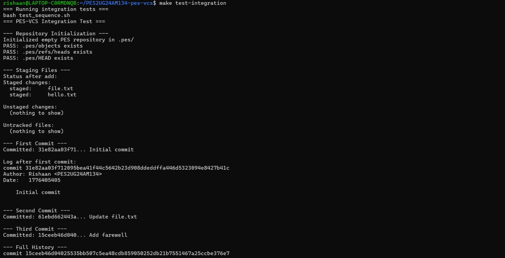
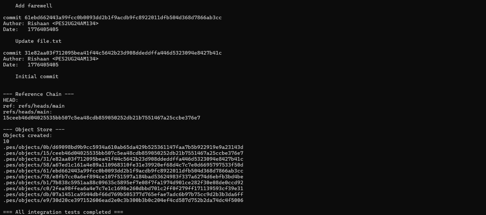

---

## Phase 5: Branching and Checkout (Analysis)

### Q5.1
To implement pes checkout, two things must change in .pes/: HEAD must be updated to point to the new branch (e.g. ref: refs/heads/newbranch), and the working directory must be updated to match that branch's tree. This means reading the target commit, traversing its tree, and writing every file to disk. Files that exist in the current tree but not the target must be deleted. The complexity lies in safely handling modified files — if a tracked file has uncommitted changes that conflict with the target branch, checkout must refuse to avoid data loss.

### Q5.2
To detect a dirty working directory, for each file in the index compare its stored mtime and size against the actual file on disk. If they differ, the file has been modified. Then check if the target branch's tree contains a different blob hash for that file. If both conditions are true — file is locally modified AND differs between branches — checkout must refuse. This uses only the index for current state and the object store for branch tree contents, with no extra metadata needed.

### Q5.3
In detached HEAD state, HEAD contains a commit hash directly instead of a branch reference. Any new commits move HEAD forward but no branch pointer is updated. Once HEAD moves away (e.g. by checking out a branch), those commits become unreachable — no ref points to them. A user can recover them by noting the commit hash from pes log before leaving, then creating a new branch pointing to that hash: create .pes/refs/heads/recovery containing the hash, and set HEAD to point to that branch.

---

## Phase 6: Garbage Collection (Analysis)

### Q6.1
The algorithm is a mark-and-sweep: start from all branch refs in .pes/refs/heads/, walk every reachable commit following parent pointers, and for each commit collect its tree hash and recursively all blob hashes. Store all reachable hashes in a hash set. Then scan every file under .pes/objects/ and delete any whose hash is not in the set. For 100,000 commits and 50 branches, you would visit at minimum 100,000 commit objects plus their trees and blobs — likely 500,000 to a few million objects total depending on repo size.

### Q6.2
The race condition works like this: a commit operation writes objects in stages — first the blob, then the tree, then the commit object, then updates HEAD. If GC runs after the blob is written but before the commit object references it, GC sees the blob as unreachable and deletes it. When the commit then tries to reference that blob, the object store is corrupt. Git avoids this by never deleting objects newer than a configurable grace period (default 2 weeks), ensuring any in-progress operations have time to complete before their objects become eligible for collection.

